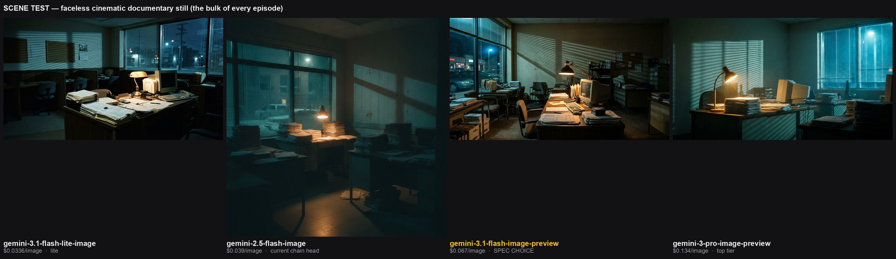
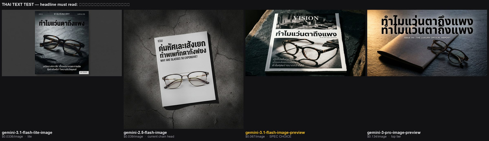

# Design: Thai pivot — @disclosedch relaunch

**Date:** 2026-08-20
**Status:** **Approved 2026-08-20.** All decision items closed. Implementation plan to follow.
**Supersedes:** the entire "Distribution model (current, 5th revision)" section of `CLAUDE.md`, and the slug-selection heuristic within it.

---

## 1. Why

The 120-day plan (Day 0 = 2026-04-19, target ~2026-08-17) closed three days ago at **8 subscribers and ~$0**. The English experiment is over, and it ended with a clean answer rather than an open question.

Every cheap-to-medium lever was tested in sequence and falsified: topic → packaging → archetype → cadence → `defaultAudioLanguage=en` → channel country=US. Three grievance ships under near-ideal conditions drew **19 / 11 / 13 impressions**.

The clean-channel test was decisive. A fresh US-country channel (Business Postmortems) running the *same three proven videos*:

- **Escaped the starve** — 313 and 815 impression bursts, so the wall was `@disclosedch`-specific, not account- or IP-level.
- **Removed the Thai signal** — subtitle language 0% Thai on both videos.
- **And still did not scale** — ~85% Suggested routing (not Browse), 1.2–2.7% CTR, mixed-language clusters, 54% TV-autoplay, plateau after a single burst.

**Reclassification was achieved and changed nothing.** The ceiling was not Thai-default classification. It was a zero-authority faceless English channel in a niche owned by Modern MBA, Cold Fusion, and Company Man. A restart alone does not fix that.

Meanwhile the same 8 weeks produced **592 commits on AIVDO**, now live at `aivdo.ai` as a Thai-first product (Free / นักเล่าเรื่อง ฿199 / ครีเอเตอร์ ฿499 / ธุรกิจ ฿1,490; Max Card + PromptPay). As of v1.57–v1.58 it is buying paid traffic, and the funnel is thin: **79 accounts, 42 video jobs in 30 days, 1 slide deck, 0 voice clips.** The stated problem is *"many users are arriving and still nobody uses it."*

So the channel's job has changed. It is no longer a standalone media bet. It is **the organic top-of-funnel for a Thai product that currently has none**, built with an engine that is already Thai-native.

---

## 2. Goal

**$10,000/month, mixed** — not $10K of AdSense.

The AdSense-only version is above the ceiling of the category. Benchmark (pulled 2026-08-20): ด.ดล Blog, the leading Thai channel in this exact niche, runs ~1.5–3M views/month at 84.9K subs after 845 episodes.

| Thai RPM (weakly sourced — see §11) | Views/mo for $10K | vs. ด.ดล Blog |
|---|---|---|
| $0.50 | 20M | ~8× |
| $1.00 | 10M | ~4× |
| $1.50 | 6.7M | ~2.7× |

The incumbent is probably earning **$750–$4,500/mo** from ads. Reaching $10K on ads alone would mean substantially out-performing them, starting from 8 subs.

**Plan against the bottom of that range.** A Thai practitioner datapoint (On The Air EP.16, `j4AM4ElN86o` @ 9:11–9:31, โมชิ — runs a 7,000-member Thai AI community) puts **1M Thai views ≈ ฿3,000 and 1M US views ≈ ฿30,000 — a 10× gap**. At ~฿33/USD that is ~$0.09 vs ~$0.91 RPM.

Those absolutes are short-form economics, not long-form — his US figure of ~$0.91 is itself far below normal US long-form rates, which is the tell, and he hedges with อาจจะ ("might"). It is one podcast remark, not measured data. But if Thai long-form holds the same ~10:1 ratio against US long-form business content (~$5–10 RPM), Thai long-form lands near **$0.50–1.00** — the low end of the table above. **Assume $0.50, not $1.50.**

Composition instead:

| Source | Role |
|---|---|
| AdSense | Lagging metric. Realistically $1–3K/mo at scale. |
| Sponsorship / brand deals | How Thai business channels actually monetise. Requires audience + authority. |
| **AIVDO conversions** | The lever with the shortest path. Attribution already instrumented (v1.57). |

**Primary KPI is `aivdo_trials_attributed` per video, not views.**

### 2.1 "Make it for America instead" — answered, do not re-litigate

The same source argues the opposite of this whole design: *don't make content for Thailand, make it for America, because the money is 10× better.* It is worth answering in writing, because the argument is superficially strong and will resurface.

**He is right about RPM and wrong about the binding constraint.**

@disclosedch already ran that experiment for three months — English, American-targeted, packaged for that audience. It returned **11, 13, and 19 impressions** per video (§1). A 10× RPM on views you never receive is worth exactly zero.

His community does earn American views, but through a different game: vertical drama, AI lullabies, affiliate review clips, run across **30–100 channels per operator**. That is a volume-and-format play. This channel is a single authority channel shipping 15-minute researched documentaries. The two do not share a distribution mechanism.

**The case for Thai is not that Thailand pays better. It is that distribution is the variable this channel can move, and RPM is not.** Optimising the unmovable variable is what the English run already did, and §1 records how it went.

If the counter-argument is ever revisited, the thing that would justify revisiting it is *evidence of American distribution* — not a better RPM number.

---

## 3. Benchmark

Reference channel: **ด.ดล Blog** (`@mrtharadhol`, brand "Geek Forever") — 84.9K subs, 2.6K videos, channel membership enabled. Pulled 2026-08-20:

| Episode | Length | Views | Age |
|---|---|---|---|
| ทำไมแว่นตาถึงแพง (why glasses are expensive) — Geek Story EP843 | 31:11 | 62K | 1d |
| De Beers diamonds — Geek Talk EP249 | 22:35 | 39K | 3d |
| Why Plasma TV died / Panasonic — Geek Monday EP337 | 15:47 | 22K | 3d |
| iPhone quietly killing Android — Geek Story EP844 | 15:28 | 15K | 1d |
| Companies cutting AI budgets, rehiring humans — Geek Story EP842 | 17:02 | 5.8K | 2d |
| ตำนาน John Titor — Geek Story EP845 | 14:14 | 4.5K | 22h |

**Three findings drive this design:**

1. **Cadence is ~2 videos/day.** Six uploads in three days.
2. **The category is curiosity, not business.** Urban legend, tech market shift, consumer pricing, labour, tech postmortem, consumer pricing. A pure business-postmortem well runs dry; a curiosity well sustains 845 episodes.
3. **Runtime is 14–31 minutes**, and the top performers are the longest ones.

Their best two (62K, 39K) are consumer-grievance / *"why is X expensive"* — the same archetype as Disclosed's only real hit (McDonald's, 679 views). **The archetype was never the problem. The market was.**

---

## 4. Positioning

**@disclosedch becomes the Thai channel.** Its Thai-default classification — the thing that poisoned the English run — is now aligned rather than fighting.

| Channel | Job |
|---|---|
| **@disclosedch** | The Thai channel. English long-form gets unlisted so the channel reads unambiguously Thai. |
| **Business Postmortems** (`UCTJDWGKcUKee7iXW2eXeUnA`) | English archive + AIVDO showcase. Correctly US-classified; McDonald's and Patagonia already public, Peloton unlisted and ready. |

No third channel.

This retires the stalled clean-channel test honestly — it answered its question, and gives Business Postmortems a second-order use instead of abandonment.

**Sequencing: unlist the English catalogue BEFORE the first Thai episode ships.** The first Thai upload is the strongest classification signal the channel will send, and it should land on a channel that reads unambiguously Thai rather than one still showing 30 English business videos. Ordering:

1. Unlist the 30 English long-form videos on `@disclosedch`
2. Rewrite channel display name + description in Thai (§5.3)
3. Ship Thai EP01

⚠️ **This is a prerequisite with a dependency:** bulk-unlisting needs a working YouTube token, and all three are dead (§9.1). Either the OAuth publishing-status fix lands first, or the unlisting is done by hand in Studio. It cannot be scripted until §9.1 is resolved.

**Follow-up:** AIVDO's README names `@disclosedch` as its showcase (McDonald's, BIC). Some of those videos were already unlisted during the June test. Showcase links repoint to Business Postmortems.

---

## 5. Format

### 5.1 Series identity

**Series tag: `Disclosed`** — Latin script, appended to Thai titles, with a persistent EP counter.

```
ทำไม TurboTax ฟรีถึงจ่าย 3,000 บาท? | Disclosed EP01
```

This is exactly the benchmark's structure: **Thai title + Latin series tag** (`... | Geek Story EP845`). `Disclosed` names a *stance* — what was hidden, revealed — not a subject, so it covers a Panasonic postmortem, an iPhone market shift, and a time-traveller hoax equally.

**Lane structure, from day one.** ด.ดล Blog runs four series under one channel, each with its own counter — Geek Daily (EP411), Geek Story (EP845), Geek Talk (EP250), Geek Monday (EP337) — split by **recency**, not by subject. This channel adopts the same idea with two lanes (§7.1), each with an independent counter:

| Lane | Tag | Runtime |
|---|---|---|
| A — current AI/tech news | `Disclosed Daily` | 8–10 min |
| B — postmortems and curiosity | `Disclosed Story` | 15–20 min |

An earlier draft deferred lanes until "volume justifies it." That was wrong: the lanes are what make the two runtimes and two gate speeds legible to a viewer, and both ship from week one.

### 5.2 Explicit rule reversal

`CLAUDE.md` currently says **avoid numeric-suffix titles.** That rule is hereby **reversed for this channel.**

It was written to prevent spammy template-farming. But a persistent EP number is a franchise signal, not a spam signal, and it is what the channel that wins this niche in Thai actually does. Reversed deliberately and in writing rather than quietly contradicted.

### 5.3 Scope

**Tech + business + curiosity.** Explicitly wider than business case studies. Matching the benchmark's range is what makes daily cadence survivable — a business-only research lane runs dry fast, and the back-catalogue cannot carry it (§7.4).

It also moves the audience closer to AIVDO's buyer: a Thai tech-curious viewer is a plausible customer; a pure business-history viewer is less so.

**Weighted toward tech, not evenly split.** Two independent Thai-market signals point the same way:

1. **ด.ดล Blog's benchmark mix** (§3) — its strongest recent performers include Panasonic's plasma collapse and iPhone-vs-Android. Tech stories, told as documentaries.
2. **On The Air EP.16 @ 3:07** (`j4AM4ElN86o`) — โมชิ ran *business and marketing* content and nobody watched: *"การทำธุรกิจมันมีคนสอนเยอะแล้ว"* — business teaching is saturated, viewers can watch someone else's. He switched to **AI and new technology** and it worked. He learned this by losing, in this market, which is why it carries more weight than his revenue claims.

**And it addresses the root cause in §1.** The English run died of zero authority in a saturated niche. The owner has genuine authority in exactly one subject — building and shipping an AI product. Tech is the one topic where this channel is not a stranger, and authority is precisely what §1 identified as the ceiling.

**Format does not change.** The lesson is *what to cover*, not how. โมชิ is on-camera and personality-driven making how-to content; this channel is faceless and runs a cinematic documentary engine. Rebuilding as an AI-tutorial channel would discard the tooling advantage and the back-catalogue that makes week one survivable. **Keep the documentary format, shift the subject matter.**

**Channel identity is rewritten to match** — the old *"business case studies built on what's actually in the filings"* is now too narrow.

| Field | Value |
|---|---|
| Display name | `Disclosed — เรื่องที่ไม่มีใครบอก` |
| Description | `เล่าเรื่องธุรกิจ เทคโนโลยี และเรื่องที่คุณสงสัยมาตลอด — จากเอกสารและแหล่งข้อมูลต้นทางจริง คลิปใหม่ทุกวัน` |

Bilingual by design, mirroring §5.1: the **channel** carries Thai, the **series tag** stays Latin — the ด.ดล Blog structure. The Thai half ("the story nobody tells") is broad enough to cover tech, business and mystery without naming a category, and it is the one place Thai keywords can be placed for free.

The description does three jobs: states the widened scope, keeps the primary-source differentiator the editorial gate exists to defend, and promises the cadence.

Changed by hand in Studio — it is a channel setting, not an API operation in the pipeline.

### 5.4 Production constants

| Constant | Value | Note |
|---|---|---|
| Runtime | **Lane A 8–10 min · Lane B 15–20 min** | Per §7.1. The single 15–20 min format could not serve news. |
| Title formula | A **family** of question/verdict openers, not one | See below |
| Voice | **Gemini TTS · `Erinome` · female · `normal` style — LOCKED** | Chosen by listening, 2026-08-20, against five other female and four male candidates. "Clear" is the closest descriptor in the table to documentary narration among female voices. Particles resolve to **ค่ะ**. Chirp3-HD stays the fallback it already is. |
| Subscribe CTA in narration | Retained | The one conversion unlock that empirically held (v4.6.3) |
| Thumbnail | Text-as-hero, Thai, **burned in by the renderer** | Never by the image model — see §6 |
| Cadence | ~1/day across both lanes, 7 days | ~4/week Lane A + ~3/week Lane B. Routine A currently runs weekdays only. |

**Title formulas.** An earlier draft specified only `ทำไม X ถึง Y?`. The benchmark uses at least eleven, and rotating them is part of why 845 episodes do not read as a template farm:

| Formula | Gloss |
|---|---|
| `ทำไม X ถึง Y?` | Why does X…? |
| `ใครฆ่า X?` | Who killed X? |
| `เกิดอะไรขึ้นกับ X?` | What happened to X? |
| `อวสาน X` | The end of X |
| `วาระสุดท้ายของ X?` | The final days of X? |
| `จุดจบ X` | The demise of X |
| `หายนะ X!` | X disaster! |
| `เปิดแฟ้มคดี X` | Opening the case file on X |
| `เจาะลึก X` / `ล้วงลึก X` | Deep dive into X |
| `ย้อนรอย X` | Retracing X |
| `X จะรอดมั๊ย?` | Will X survive? |

Rotate deliberately; do not let one formula dominate a month.

### 5.5 Voice and register

Narration is **Thai TTS** via AIVDO's native path. Already in place:

- `language_code` defaults to `th-TH`
- **Locked: Gemini TTS, voice `Erinome`, female, `normal` speaking style.** Chosen by listening on a 37-second script carrying figures, a reveal beat and the subscribe CTA — not on descriptors. Ten candidates were sampled (six female, four male including the incumbent `Algieba`); harnesses in `assets/`.
- Thai particles auto-agree to voice gender (`e2775e9` — *"a woman no longer says ครับ"*), so every episode closes in **ค่ะ**. Script review checks this rather than assuming it.

**Two systems, not two voices — an earlier draft of this spec got this wrong.** It claimed the voice was `th-TH-Chirp3-HD-Achernar` and that "Algieba is retired." In fact:

| | Gemini TTS | Chirp3-HD |
|---|---|---|
| Role | **Primary** — `gemini-2.5-flash-preview-tts`, voice `Algieba` | **Fallback** — fires on Gemini 5xx or empty response |
| Endpoint | Vertex Gemini TTS | `texttospeech.googleapis.com` |
| Voices | Multilingual personas speaking Thai | Native Thai voices |
| Style control | **Yes** — `STYLE_PROMPTS`: normal / lively / calm / dramatic | No, plain text in the current call path |

Choosing Chirp3-HD would mean promoting the fallback to primary and rewiring the TTS path, not renaming a voice. **Decision: stay on Gemini TTS** — style control matters for a documentary narrator, and Chirp3-HD remains a working fallback.

⚠️ **`Algieba` is male.** `config.py:209` reads `{"gender": "male", "style": "Smooth"}`, and AIVDO's particle logic gives it **ครับ**. The channel's configured narrator was therefore male across the entire English run.

**Where the change goes.** `voice_name` is a **per-request field** — the shipped `REQUEST_PART_*.json` files carry `"voice_name": "Algieba", "language": "en-US"`. So the narrator is set in the **channel's request templates**, during the `prompts/` port (§6). Do **not** change `TTSConfig.voice_name`: that is AIVDO's product-wide default and would re-voice every customer's renders. Changing it is a separate product decision and is out of scope for this spec.

⚠️ **Quota risk.** On 2026-05-01 the AI Studio free-tier 100/day cap blocked a render, which is why `backend` is `vertex`. Daily 15–20 min episodes multiply TTS volume several-fold — **verify quota headroom before the cadence ramps.**
- Thai speaking rate corrected (`2382bea` — the prior guess was +72% wrong)

**The register rule — the biggest quality risk in this design.**

The benchmark channel is narrated by a real person. We are TTS. The audible tell, however, will not be the voice — Chirp3-HD is good — it will be the **script register**.

Thai splits hard between written and spoken register. A literal translation of English documentary prose yields stiff, formal, written-register Thai that sounds synthetic through even a perfect voice. This risk lands hardest on back-catalogue remakes (§7.4), whose episodes *are* translations.

**Rule: Thai scripts are written in spoken register, not translated from English.**

**Second rule: rigour must not cost digestibility.** โมชิ's observation (`j4AM4ElN86o` @ 3:48) is that he found a 1M-view video teaching how to sign up for Gmail, and concluded the market rewards **ย่อยง่าย** — easy to digest — far more than it rewards depth. The editorial gate (§8) optimises hard for rigour, and rigour stays: it is the differentiator no competitor has. But a script that is accurate and hard to follow fails anyway. Script review checks both.

Practically, a remake takes the English script as a *source of verified facts and structure*, then is written fresh in spoken Thai — not rendered sentence-by-sentence. Register review is part of the Remake gate (§8), alongside translation fidelity.

Precedent: the channel has been caught on AI-detection twice in English (a narration complaint, then a complaint that the *reply* to it was also AI-written). Thai raises the stakes because the audience is native and the owner can hear the problem directly — which also makes it fixable in a way it never was in English.

---

## 6. Pipeline changes

| Change | Where | Size |
|---|---|---|
| **2 parts → 4–5 parts** for 15–20 min | `render.py:257` `main()` hardcodes `p1`/`p2` and `stitch([p1, p2], ...)`. Glob `REQUEST_PART_*.json` instead. `stitch()` and `render_part()` are **already N-generic**. | Small |
| **Gemini-only image routing** | `render.py:136` `cinematic_engines` is an OpenAI-only allowlist. AIVDO's `aivdo/modules/google_image.py` chain and Gemini-3 prices in `image_cost_table.py` already exist. | Small — routing, not new engineering |
| **Thai text burned by renderer** | Needs a Thai font in the burn-in path. AIVDO solved the analogous case with Noto CJK for JP/CN/KR subtitles (`f389b40`). | Medium |
| **`prompts/` ported to Thai** | The 17-prompt library is English-tuned throughout. | **Largest single item** |
| **Veo hook on Shorts only** + prompt guard | `make_short.py` + AIVDO's existing Veo lane | Medium |
| **Routine A: weekdays → 7 days** | Daily means Saturday and Sunday | Trivial |

### 6.1 Image generation — Gemini only, no OpenAI

**Default: `gemini-3.1-flash-image`** (stable, $0.067/image).

Chosen on evidence, not price. A same-prompt sweep across the whole available chain on a faceless cinematic documentary scene (2026-08-20; harness in `assets/imgcmp.py` + `assets/imgcmp_lite.py`, output below):




| Model | $/img | Scene verdict |
|---|---|---|
| **`gemini-3.1-flash-image`** | 0.067 | **Best.** Richest storytelling density — period CRT, stacked file boxes, corkboard, street through window, warm lamp against cold glass. |
| `gemini-3-pro-image` | 0.134 | Cleanest light modelling but sparser and emptier. More designed, less documentary. Not 2× better. |
| `gemini-3.1-flash-lite-image` | 0.0336 | Genuinely usable. Flatter light, less drama, correct period detail. |
| `gemini-2.5-flash-image` | 0.039 | **Worst.** Muddy, teal-crushed, no period specificity — and it is AIVDO's *current* chain head. |

Rationale for spending above lite: every video is also an AIVDO demo. Image quality is marketing, not only retention.

**Pin stable names, not `-preview`.** `gemini-3.1-flash-image`, `gemini-3-pro-image` and `gemini-3.1-flash-lite-image` all now exist without the suffix. Previews get deprecated.

**Replacement fallback chain** (see §6.5): `gemini-3.1-flash-image` → `gemini-3.1-flash-lite-image` → `gemini-3-pro-image`.

**Aspect ratio must be set by config, not prompt.** Measured from the sample PNGs (2026-08-21): `gemini-3.1-flash-lite-image`, `gemini-3.1-flash-image` and `gemini-3-pro-image` all returned **1376×768 (1.79)** from the in-prompt 16:9 instruction; **`gemini-2.5-flash-image` returned 1024×1024** and ignored it.

*An earlier draft of this line blamed lite for the square output. That was wrong — the offender is the model we are replacing, which strengthens rather than weakens the case for the change. Corrected against the actual file dimensions.*

⚠️ **Watch item: people hallucinated into personless scenes.** AIVDO's own auto-memory (`reference_nano_banana_2_evaluated_rejected`, probed 2026-07-31) records that `gemini-3.1-flash-lite-image` invented a woman **2 for 2** on real condo photos, and `gemini-3.1-flash-image` added a Roman bust and oil lamp to a bed — verdict then was "stay on gemini-2.5-flash-image". For a **faceless** channel that failure mode is the one that matters most.

Two reasons it is a watch item and not a blocker:
1. **Different task.** That probe was the *reference compositor* — image-to-image, filling a scene around a real photo. This channel is text-to-image with an explicit negative constraint.
2. **Checked directly.** All four sample scenes rendered from a prompt ending "No people. No text. No logos." are **empty of people** — including both rejected models. See `assets/2026-08-20-compare_scene.jpg`.

`video_intent="faceless_youtube"` server-enforces no-faces per scene as a second layer. **Still: inspect the first real render for invented people before treating this as settled.** One clean sweep on one prompt is not proof.

### 6.2 Thai text is never generated by an image model

All Thai on-screen text — titles, callouts, thumbnails, subtitles — is burned in by the renderer with a proper Thai font.

**The rule stands, but its original rationale is obsolete.** `aivdo/config.py:153` (2026-06-27) records that *`gemini-3-pro-image-preview` renders Thai/CJK reliably, flash-image garbled it*, and commit `32ad47b` fixed `/omni` by banning Thai text in generated images outright.

A direct test on 2026-08-20 (headline required to read `ทำไมแว่นตาถึงแพง`) shows that comparison no longer holds:




| Model | Result |
|---|---|
| `gemini-2.5-flash-image` | **Garbled** — *ค่มหัศและเส้งเยก / ทำเพกักตากั้งฟยง* is nonsense. Rendered the English subtitle correctly and mangled the Thai. Matches the June comment exactly. |
| `gemini-3.1-flash-lite-image` | **Correct**, headline and body copy — from the cheapest model in the chain. |
| `gemini-3.1-flash-image` | **Correct**, headline plus three lines of body Thai. |
| `gemini-3-pro-image` | Headline correct, but **duplicated the line**, printing a malformed second copy beneath it. |

The June comment compared 2.5-flash against 3-pro. The entire 3.1 generation spells Thai, and pro was the only model with an artifact.

**So the rule is now justified by control, not capability:** franchise typography must be identical across hundreds of episodes, must use a chosen Thai typeface, and must not vary with model version or sampling luck. Generated Thai text is unrepeatable; renderer-burned Thai text is deterministic.

### 6.3 Motion: Veo for hooks, not bodies

| Element | Backend | Cost |
|---|---|---|
| Shorts hook, first 3–5s | Veo 3.1 | $1.20–2.00 |
| Identity-held motion (recurring subject) | Omni (`gemini-omni-flash-preview`) | per AIVDO preset |
| Body scenes | `zoom_pan` stills | image cost only |

A full 60s Short on Veo 3.1 is ~$24 ($9 on Fast) — not viable daily.

This pattern is already shipped and **measured** in AIVDO v1.58: hook inter-frame motion **2.944 across 0–3s** against **0.694 / 0.398 / 0.189** behind it.

**The hook should buy a demonstration, not decoration.** `j4AM4ElN86o` opens with roughly twenty seconds of pure spectacle — a live face-swap, a dog appearing in-hand — before a single word of framing. The Veo budget is best spent on a shot that *shows the thing the episode is about*, not on a handsome establishing frame.

**Two guards, both from prior findings:**

- **Veo prompt guard — no brand names, no named people, environment only.** The May Veo POC found brand-name prompts produced in-scene watermarks and unreliable faceless compliance. Both are fatal for a faceless channel doing brand postmortems.
- **Tail-drift caveat.** At 0.189, late scenes read noticeably more static than the opening. Acceptable across 60s; needs watching across 15–20 min.

### 6.4 The Thai speaking-rate trap

AIVDO commit `2382bea`: *"the Thai speaking rate was a GUESS and it was wrong by +72%."*

Script length must be scoped against the **corrected Thai rate**, never English words-per-minute. Getting this wrong lands every 15-minute target at ~25 minutes — a systematic error across every episode, discoverable only after rendering.

**Measured 2026-08-20, and the constant is wrong in a second way.** Two sweeps:

| Script | Content | Measured rate |
|---|---|---|
| ~200 chars, prose | plain narration | **11.3–11.4 c/s** — matches the table |
| ~509 chars, figure-dense | years, percentages, baht amounts | **12.5–13.7 c/s** across ten voices |

Number-dense Thai is character-heavy but spoken quickly — *สี่ร้อยห้าสิบ*, *แปดสิบเปอร์เซ็นต์* — so character count **over-predicts duration by 11–21%** on exactly the kind of script this channel writes. Same class of error as the old `+72%` bug, opposite direction.

There is also a **~10% spread between voices** on identical text (Despina 36.85s → Sadaltager 40.69s) — about 90 seconds across a 15-minute episode.

**Why `normal` is locked rather than `dramatic`/`calm` (measured 2026-08-20).** Same script, same voice: normal 38.21s (13.2 c/s), dramatic 45.41s (11.1), calm 50.45s (10.0). AIVDO's *style ratios* hold up well (dramatic÷normal 0.78 table vs 0.84 measured; calm÷normal 0.73 vs 0.76) — it is the absolute baseline that is too slow. **Keep the ratios, raise the baseline.**

~~The deciding factor was per-scene energy control.~~ **That reason was wrong — corrected 2026-08-21.**

`_ENERGY_TAGS` in `voice_synthesizer.py` does give per-scene control (`high` → `[excited] [fast]`, `low` → `[calm] [slow]`) and does apply only when `speaking_style` is `normal`. But **the channel never reaches it.** Inspection of the shipped `REQUEST_PART_1.json` shows the `text` field carries **narration only** — 3,294 chars of plain prose. Every `[Scene N | high]` marker, `OVERLAYS:` line and energy tag in `SCRIPT.txt` is **stripped before the request is built**, and AIVDO re-derives its own scenes from the bare text. Those markers are authoring metadata for the prompt flow, not a channel-to-server signal.

So `normal` does not currently *preserve* per-scene variation, because there is no per-scene variation to preserve.

**The decision stands, on the reason that actually held:** the owner picked `Erinome` at `normal` by listening to all three styles, and `dramatic` ("like a movie trailer narrator") and `calm` ("like a meditation guide") are both wrong for a 15-minute documentary. The measured pace table above is unaffected.

**Newly open, and deliberately not solved here:** if per-scene energy is wanted, something has to send it — a channel-side mechanism that does not exist today. Belongs with the prompt-library work, not with the voice decision.

**Working budget for `Erinome` at `normal`:** ~11.3 c/s for prose, ~13.2 c/s for figure-dense passages. A 15–20 min Lane B episode lands near **10,000–14,000 Thai characters**; a Lane A 8–10 min episode near **5,400–7,900**.

**Confirm against the first full render of each lane and correct before episode 2.** Per `scene_planner.py`'s own warning, verify by ffprobing a real render — never the estimator, which measures its own prediction.

---

### 6.5 AIVDO's fallback chain is broken (pre-existing production bug)

Found while running the §6.1 sweep, on 2026-08-20:

```
imagen-4.0-fast-generate-001 → 404 NOT_FOUND
imagen-4.0-generate-001      → 404 NOT_FOUND
```

Neither Imagen model is available on the production API key. `DEFAULT_GOOGLE_CHAIN` in `aivdo/modules/google_image.py` is `gemini-2.5-flash-image` → `imagen-4.0-generate-001` → `imagen-4.0-fast-generate-001`, so **positions 2 and 3 are dead and the chain has no working fallback**. Any render whose head model fails, fails outright.

This is independent of the pivot — it affects AIVDO in production today. Fix scheduled in the implementation plan, not applied here: replace the chain with `gemini-3.1-flash-image` → `gemini-3.1-flash-lite-image` → `gemini-3-pro-image`, and update `image_cost_table.py`, which likewise knows only the `-preview` names.

## 7. Content plan

### 7.1 Two lanes, split by recency

The benchmark does not run one format. ด.ดล Blog runs **four lanes at different recency** — Geek Daily (EP405–411, newest news), Geek Story (EP808–845, main lane), Geek Talk (EP240–250, geopolitics), Geek Monday (EP334–337, postmortems) — and **roughly 40% of its last 60 uploads is current AI/tech news, not history** (Perplexity, Gemini, DeepSeek, the Copilot backlash, the Oracle AI-bubble question, OpenAI vs Apple, Korea's chip crash).

This channel runs two:

| | **Lane A — News** | **Lane B — Documentary** |
|---|---|---|
| Subject | Current AI/tech events | Postmortems, "why X died", curiosity |
| Runtime | **8–10 min** | **15–20 min** |
| Cadence | ~4/week | ~3/week |
| Gate mode (§8) | Research / verifiable, **fast path** | Research / verifiable or attribution |
| Shelf life | Days | Years |

Together they hold the ~1/day cadence (§5.4). The lanes exist because **a single 15–20 min format cannot serve both** — see §7.5.

### 7.2 Lane A leads. The reasoning is competitive.

**Against an incumbent with 2,600 videos, history is their moat and news is a level playing field.** They can pre-empt any postmortem, and already have — Blackberry is covered twice on their channel (§7.6). Nobody can pre-empt a story that broke this week.

Four supporting reasons:

1. **It is 40% of what the benchmark ships** — the lane is proven in this market.
2. **It is where the channel's authority actually is** (§5.3). The owner builds and ships an AI product. §1 identified zero authority in a saturated niche as the thing that killed the English run; this is the one subject where that does not apply.
3. **It does not depend on the back-catalogue**, whose remake-able inventory is unverified (§7.4).
4. **It converts best to the KPI.** A viewer watching a current AI story is closer to an AIVDO buyer than one watching a retail bankruptcy.

### 7.3 Lane B — documentary

The original format: postmortems, "why X died", tech and consumer curiosity. Weighted toward tech per §5.3.

Sourced from fresh Thai research, and opportunistically from the back-catalogue (§7.4). Runs the full 17-prompt routine.

### 7.4 The back-catalogue is demoted to filler

The spec originally made Thai remakes of ~20 published videos the daily engine of week one. **That plan is substantially weaker than it looked**, for a reason independent of the inventory problem:

> **The back-catalogue was selected for Americans.** Every slug in it passed the retired "would a 55-year-old American man recognise this" gate. Translating it into Thai inherits American topic selection wholesale.

Filtering the catalogue by actual Thai relevance:

| Survives | Fails — brand barely exists in Thailand |
|---|---|
| McDonald's, IKEA, Tupperware, Bic, Lululemon | TurboTax, MoviePass, DocuSign, Costco, Circuit City, Ticketmaster, Amazon–Whole Foods |

So remakes become **opportunistic filler for Lane B**, not the engine. The ~15-minute Remake gate (§8) still applies and is still the cheapest content available — there is just less of it than the spec assumed, and it cannot carry the cadence alone.

⚠️ **Supply counted 2026-08-21, and it is far worse than this section assumed. The remake pool is effectively empty.**

Of 18 `Daily/` directories on disk, **only 2 contain a `SCRIPT.txt`** — the one artefact a Thai remake actually needs. The other 16 hold only build output: `render.log`, `upload.log`, thumbnails, `final_short.mp4`.

The two that do have scripts are **#56 Ticketmaster and #57 TurboTax** — and both **fail the Thai-relevance filter above** (US-only products a Thai viewer has never used). Every slug that passes the filter — McDonald's, IKEA, Tupperware, Bic, Lululemon — **has no script on disk.**

So the two sets do not intersect: **zero slugs are both remake-able and Thai-relevant.**

**Drive checked 2026-08-21. The scripts are not there either — the pool is zero, definitively.**

`My Drive/vdo-no-face/Daily/` contains **two folders, both empty shells** from the 2026-04-24 dry run (`costcos-1-50-hot-dog`). None of the 18 shipped episodes exist in the vault.

**This makes `CLAUDE.md` stale on a load-bearing point.** It states Drive is canonical for `Daily/<slug>/`. That was true of the Routine-A flow; the last ~16 ships were fired manually in-session and wrote only to local disk. Anyone trusting `CLAUDE.md` would look in the wrong place and conclude the scripts were lost.

**One recovery path remains, at some fidelity cost:** the episodes are published on YouTube with auto-captions. `yt-dlp --write-auto-sub` recovers the narration — that is how the On The Air transcript in §2 was obtained. Auto-captions garble numbers and proper nouns, so a recovered script would need re-verification against sources rather than inheriting the original's `.facts_verified` status. That converts a Remake-gate job (~15 min) into a Research-gate job (~30–45 min), which removes most of the reason to prefer remakes at all.

**This strengthens §7.2 rather than threatening it.** Lane A leads precisely because it needs no back-catalogue. Had the plan kept remakes as the daily engine, week one would have had nothing to ship.

### 7.5 What Lane A costs the pipeline

News fights the current pipeline, and the lane split is the answer rather than a wish:

| Constraint | Lane B (15–20 min) | Lane A (8–10 min) |
|---|---|---|
| Research gate (§8) | 30–45 min | **fast path required** |
| Render | ~2 h | ~1 h |
| Images (§11) | ~64–80 | ~32–40 |
| Shelf life | years | **days** |

A story that renders after its news cycle closes is worth nothing, so Lane A is **shorter on every axis** — fewer scenes, shorter script, a leaner gate. The machine first pass (§8) matters most here: it is what makes a same-day turnaround plausible.

**Lane A must not become a rumour lane.** Speed pressure is exactly the condition under which the editorial gate gets skipped, and the gate is the channel's only real differentiator. A Lane A story that cannot be verified in its fast path is **dropped, not shipped hedged**.

### 7.6 Shorts

**Daily**, cut from the prior day's long-form via `make_short.py`, with a Veo hook on the first 3–5s (§6.3) and the character-anchored injustice angle the existing Shorts pattern already uses. No pinned comment.

This means **two uploads per day** — one long-form, one Short. Both count toward the editorial-attention budget (§8), and the Short's ~10 minutes of work is additive to the long-form gate, not included in it.

The §11 Veo line (~30/month) assumes exactly this cadence.

**Shorts are a reach play, not a revenue line.** At Thai short-form rates — on the order of ฿3 per 1,000 views (§2) — daily Shorts contribute effectively nothing to AdSense. They are justified by discovery, subscriber conversion, and feeding `aivdo_trials_attributed`; they are not justified by ad revenue, and their Veo cost should be judged against reach, not earnings. If they stop producing subscribers or attributed signups, cut them — the cost case never rested on views.

### 7.7 Saturation audit — run it in both directions

The audit previously ran against Modern MBA / Cold Fusion / Company Man. In Thai it runs against:

- ลงทุนแมน (Longtunman) — 824K subs, 2.5K videos. **Owns Thai corporate stories** — the natural home of the Thai/SEA slugs, so audit there before claiming that gap.
- The Secret Sauce
- Mission to the Moon
- **ด.ดล Blog's own 2,600 episodes** — the primary competitor for Lane B
- **Thai AI/tech creators**, โมชิ's channel among them — the primary competitors for Lane A, and the most contested part of this market precisely because it works

**A "no match" result is not automatically a green light.** ด.ดล Blog ships ~2/day across every corner of tech. When a topic is missing from 2,600 videos, the likeliest explanation is that it does not work for a Thai audience — not that nobody thought of it. TurboTax, MoviePass and DocuSign all came back clear, and all three are US-only products a Thai viewer has never used. **Read absence as a signal about relevance, then decide; do not read it as an opening.**

Recorded hits (2026-08-20):

| Slug | Status |
|---|---|
| Blackberry (#7) | **Covered twice** — EP537 (10K, 8mo), Geek Monday EP264 (5.4K, 1yr). Cut. |
| Allbirds (#39) | **Covered** — Geek Story EP838, and recently. Cut. |
| Panasonic / plasma | Covered — EP337, EP830 |
| TurboTax, MoviePass, DocuSign | No match — but failing the relevance test above |
| Peloton (#38) | Effectively clear (one tangential Geek Daily EP76, 23 views, 5 years old) |
| Thai Airways / การบินไทย | No match — it is a tech channel. Audit against ลงทุนแมน instead. |

Check happens **before** each ship.

---
## 8. Editorial gate v2 — four modes

A single gate cannot survive daily cadence plus the widened scope. It splits by slug type.

| Mode | Applies to | Discipline | Budget |
|---|---|---|---|
| **News / fast path** (Lane A) | Current AI/tech events | Primary source or first-party announcement, named on screen. Two independent reports minimum for anything contested. **No speculation presented as reporting.** | ~15 min |
| **Remake** | Thai versions of relevant back-catalogue slugs (§7.4) | Translation fidelity (do numbers, names, dates survive intact) **+ spoken-register review** (§5.5) | ~15 min |
| **Research / verifiable** (Lane B) | New business + tech slugs with primary sources | Full `lint_urls.py` → REVIEW.md → `propagate_correction.py` | ~30–45 min |
| **Research / attribution** (Lane B) | Legends, hoaxes, unresolved claims (John Titor-type) | **Never assert — attribute.** Report accurately what was claimed and by whom. | ~20 min |

**Machine first pass.** AIVDO already carries `video_verifier_model: gemini-3-flash-preview`, a narration-grounding pass. Wiring it ahead of the human gate is the single highest-leverage change for making daily cadence survivable. It filters what reaches the human gate; it does not replace it. **Lane A depends on it** — the fast path is only credible with a machine pass in front.

⚠️ **The News mode is where the gate is most likely to fail.** Speed pressure is precisely the condition under which verification gets skipped, and the gate is this channel's only real differentiator (§5.3). The rule is absolute: **a Lane A story that cannot be verified inside its fast path is dropped, not shipped hedged.** Missing a news cycle costs one video. Shipping a wrong fact costs the thing the whole channel is built on.

**Unchanged:**

- `.facts_verified` still blocks render.
- **Comment replies stay hand-typed by the channel owner.** This came from a real incident where the audience caught an AI-written reply to an AI-detection complaint. Easier in Thai, not harder.

**Retired:** the `≤3 videos/week` cap. Its impression-rationing rationale was falsified by the project's own later data; its *editorial-attention* rationale was real, and the four-mode gate plus the machine first pass is what retires it. The cap is replaced by the gate, not simply dropped.

---

## 9. Infrastructure prerequisites (blocking)

1. **All three YouTube OAuth tokens are dead** (`invalid_grant` on `token.json`, `token_newchannel.json`, `token_disclosed.json`). More important than re-authing: **check the OAuth app's publishing status.** Testing-mode apps expire refresh tokens every 7 days, which matches the recurring `invalid_grant` pattern. At ≤3/week that was an annoyance; at daily cadence a weekly token death stops the channel. **Move the app to Production — do not just re-auth.**
2. **Analytics token** (`token_analytics.json`) likewise — without it the §10 day-14 checkpoint cannot be measured, and that checkpoint is the whole test.
3. **Thai font** available to the renderer burn-in path.

---

## 9.4 Critical path

§4 gives the ship ordering and §9 gives the blockers; combined they are one chain, not parallel chores:

```
OAuth app → Production   (unblocks every token)
        ↓
re-auth upload + analytics tokens
        ↓
unlist 30 English videos ──┐
        ↓                  │  fallback: unlist by hand in Studio,
rewrite channel identity ──┘  which decouples shipping from the OAuth fix
        ↓
ship Thai EP01
        ↓
day-14 routing checkpoint  (needs the analytics token)
```

**The fallback matters.** Hand-unlisting in Studio is tedious but unblocking — it means EP01 is not held hostage to a Google Cloud console task. The OAuth fix is still required before daily automated uploads, and before the day-14 checkpoint can be measured.

---

## 10. Measurement

Every episode ships with its own `utm_campaign`, flowing into the AIVDO attribution admin panel that landed in v1.57.

`pipeline.json` already carries the needed columns, unused since April: `utm_campaign`, `thumbnail_ctr_pct`, `views_7d`, `views_30d`, `aivdo_trials_attributed`.

### Day-14 routing checkpoint — hard gate

There is **no pre-pivot Thai performance data** — `Daily/` begins 2026-04-29, after the Thai→English flip. So the claim that @disclosedch's Thai classification is an *asset* rather than merely not-a-liability is **untested**. This checkpoint tests it.

| Result at day 14 | Action |
|---|---|
| Thai ships draw real Browse impression batches | Thai classification is an asset. Continue; ramp both lanes. |
| Thai ships starve at 11–19 impressions, as the English ships did | The channel is poisoned for **any** language. Move to Business Postmortems or a fresh Thai channel. |

Pre-committed action, not a hope. Requires the analytics token (§9.2) and Studio screenshots (impressions are Studio-only).

---

## 11. Costs

Scene count scales with runtime, so the two lanes cost differently: **Lane B (15–20 min) ~64–80 images**, **Lane A (8–10 min) ~32–40**. The table below prices Lane B; Lane A is roughly half. At ~3 Lane B + ~4 Lane A per week the blended monthly figure lands near **two-thirds** of the daily-Lane-B numbers shown.

| Image model | $/img | Per video | Daily (30/mo) |
|---|---|---|---|
| `gemini-3.1-flash-lite-image` | 0.0336 | $2.15–2.69 | $65–81 |
| `gemini-2.5-flash-image` | 0.039 | $2.50–3.12 | $75–94 |
| **`gemini-3.1-flash-image` (chosen)** | **0.067** | **$4.29–5.36** | **$129–161** |
| `gemini-3-pro-image` | 0.134 | $8.58–10.72 | $257–322 |

Imagen 4 is absent from this table because it is **not available on the production key at all** (§6.5).

**Batch API halves every figure above** (a 1K image drops to ~$0.034 at the flash tier). Episodes are produced a day ahead of publication, so batch is compatible with the cadence — worth evaluating in the implementation plan, and it would bring the chosen tier to roughly **$65–80/mo**.

Plus Veo hooks on Shorts (~$1.20–2.00 each, ~$36–60/mo) and TTS.

**All-in ≈ $170–230/month** at the chosen tier.

### Sourcing caveats

- **Thai RPM figures in §2 are weakly sourced.** Searches returned thin and mutually inconsistent Thailand data; one result (฿216 per 1,000 views) is implausible and was discarded. The one practitioner datapoint since found (§2) is a podcast remark about short-form, explicitly hedged, and is used only to argue that the estimate should sit at the low end — not as a measurement. The §2 conclusion holds across the entire plausible range, but no single RPM figure here should be treated as reliable. **The first real number will come from the channel's own AdSense once monetised.**
- **Benchmark numbers in §3 were pulled 2026-08-20** and are a single-day snapshot of six videos, several still accruing views.
- **Gemini and Veo prices** are from public 2026 pricing pages, cross-checked against AIVDO's own `image_cost_table.py`. Veo pricing conflicts with the May 2026 POC note (~$2.80 for 56s); verify against live billing before committing to Shorts volume.

---

## 12. Decisions locked

| Decision | Value |
|---|---|
| Channel | Revive `@disclosedch` in Thai; Business Postmortems becomes English archive + showcase |
| Goal | $10K/mo **mixed** (ads + sponsorship + AIVDO), not AdSense-only |
| Primary KPI | `aivdo_trials_attributed` per video |
| Cadence | ~1/day long-form + 1/day Short, 7 days/week |
| Lanes | A: news, 8–10 min, ~4/wk · B: documentary, 15–20 min, ~3/wk (§7.1) |
| Lane priority | **Lane A leads** — news is the level playing field against a 2,600-video incumbent (§7.2) |
| Back-catalogue | Demoted to Lane B filler; it was selected for Americans (§7.4) |
| Runtime | 15–20 min |
| Series tag | `Disclosed` + EP counter; lanes split later |
| Channel identity | `Disclosed — เรื่องที่ไม่มีใครบอก`, Thai description (§5.3) |
| Scope | Tech + business + curiosity, **weighted toward tech** (§5.3) |
| Images | Gemini only, default `gemini-3.1-flash-image` (stable) — chosen on a same-prompt sweep, §6.1 |
| Thai text | Never image-model generated; renderer burn-in only |
| Motion | Veo hook (3–5s) on Shorts only; Omni for identity-held; `zoom_pan` bodies |
| Voice | Gemini TTS · `Erinome` · female · `normal` style, locked permanently; Chirp3-HD stays fallback |
| Sequencing | Unlist English catalogue → rewrite channel identity in Thai → ship EP01 |
| Editorial gate | Three modes + machine first pass |
| Hard gate | Day-14 routing checkpoint |

## 13. Open items

- **AIVDO fallback-chain fix** (§6.5) — chain replacement + `image_cost_table.py` update scheduled for the implementation plan; **not applied yet**, and it is a live production bug meanwhile.
- **Batch API** (§11) — halves image cost and fits a day-ahead production rhythm. Evaluate during implementation.
- **Stale documentation.** This spec supersedes `CLAUDE.md`'s distribution model, slug-selection heuristic, `≤3/week` cap, Algieba voice, and 8-minute runtime — but `CLAUDE.md` is **not yet updated**, so those still read as current instructions. Several memory files are likewise superseded. Both are updated after this spec is approved: `CLAUDE.md` rewrite belongs in the implementation plan, and superseded memories get **marked superseded, not deleted** (they hold the audit trail for why the English run was abandoned).
